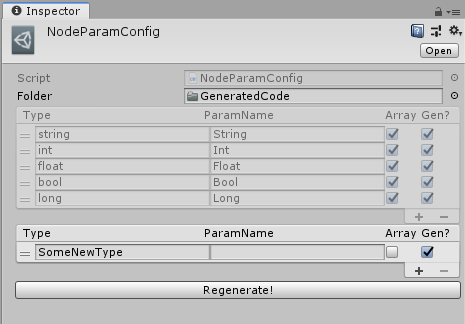
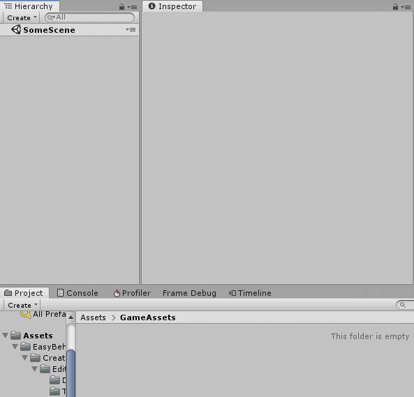
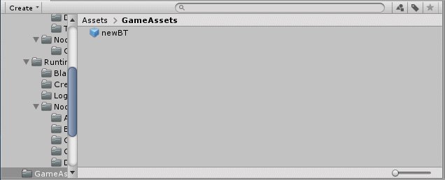
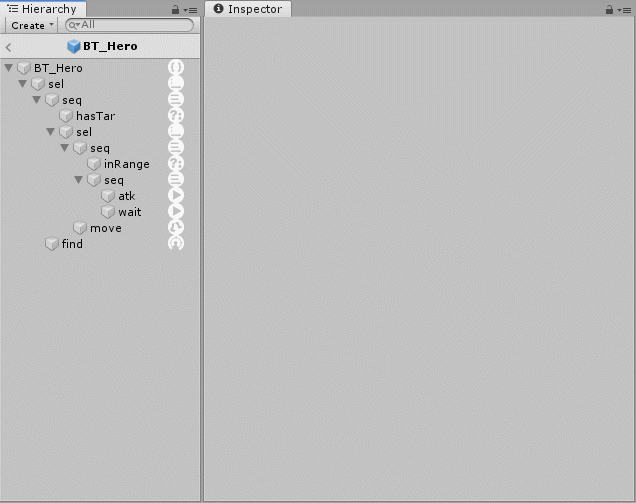
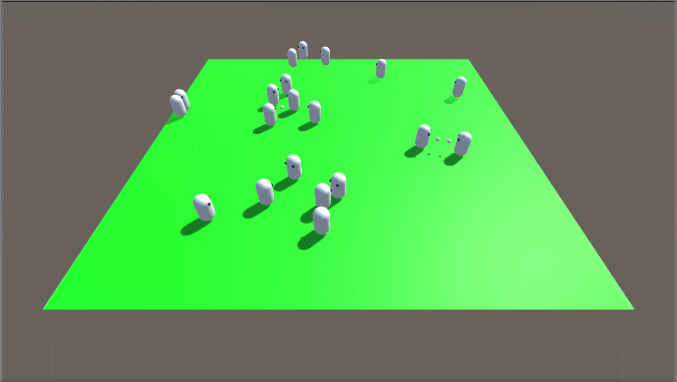

## Easy Behavior Tree

A very simple behavior tree implementation, including:

1. Basic behavior tree functions in C# but independent of any Unity Engine codes;

2. A behavior tree can run totally without a GameObject;

3. A behavior tree creator with Unity Editor in which binary format behavior tree files can be generated;

4. Types of nodes, node parameters and blackboard data can be easily extended;

5. Debugging system including logger interfaces and node info fomatters;

## Requirement

The project is created with Unity 2018.3.6f, any other older or newer versions are not tested at the moment;

## Usage

### Create new nodes

1. Create new node classes simply by extending the provided base types like `NodeAction`, `NodeComposite`, `NodeCondition` or `NodeDecorator`:

    ```C#
    using EasyBehaviorTree;
    [System.Serializable]
    public class NodeTest : NodeAction
    {
        // ...
    }
    ```

2. Implement or override the methods:

    ```C#
    public class NodeTest : NodeAction
    {
        public override void Cleanup()
        {
            // your cleanup logic
        }

        protected override BTState ExecuteTask(float deltaTime)
        {
            // your execute logic

            // ...

            return BTState.Success;
        }
    }
    ```

3. Add `NodeParam` attribute to a field of your class if you want it to be exposed and modified in Creator:

    ```C#
    public class NodeTest : NodeAction
    {
        [NodeParam]
        private int foo;

        [NodeParam]
        private float bar;

        // ...
    }
    ```

4. If your node field has a type that is not included in `NodeParamConfig`, you can simply add the type name in **NodeParamConfig.asset** and click `Regenerate`:

    

5. Custom icons can be assigned to your node classes if you add a `NodeIcon` attribute to the class with the path of icon asset as argument:

    ```C#
    [System.Serializable]
    [NodeIcon("Assets/icon_for_node_test.png")]
    public class NodeTest : NodeAction
    {
        // ...
    }
    ```

### Create behavior trees

1. Create an empty prefab with the same name as your behavior tree;

2. Create new empty gameobjects under the root of your prefab and a `NodeDefine` component should be attached to every gameobject in the hierarchy:

    

3. The structure of the prefab will be the the structure of your behavior tree, that means every gameobject with `NodeDefine` will be converted to a corresponding behavior tree node;

4. Modify params of the nodes, change their names, or just add some description text in Unity inspector window;

5. Save the prefab and right click it, and then select 'CreateTreeAsset' to create a behavior tree asset:

    

6. The following is a prefab named `BT_Hero` in sample directory:

    

and the tree information with `DefaultFormatter`:

    ```
    root(EasyBehaviorTree.NodeRepeater) {repeatTimes=0,ignoringFailure=False}
    -sel(EasyBehaviorTree.NodeSelector) {}
    --seq(EasyBehaviorTree.NodeSequence) {}
    ---hasTar(HasTarget) {}
    ---sel(EasyBehaviorTree.NodeSelector) {}
    ----seq(EasyBehaviorTree.NodeSequence) {}
    -----inRange(InAttackRange) {}
    -----seq(EasyBehaviorTree.NodeSequence) {}
    ------atk(AttackTarget) {}
    ------wait(EasyBehaviorTree.NodeActionWait) {time=1}
    ----move(ApproachTarget) {}
    --find(FindTarget) {}
    ```

### Runtime operation

1. Load a binary behavior tree asset with `BehaviorTree.LoadBehaviorTree` to create a behavior tree instance:

    ```c#
        // string fullPath = ...
        BehaviorTree behaviorTree = BehaviorTree.LoadBehaviorTree(fullPath);
    ```

2. `Restart` should be called before you tick your behavior tree:

    ```C#
        behaviorTree.Restart();
    ```

3. `Tick` should be called every frame (or driven by other systems) and the delta time should be passed as argument;

    ```C#
        void Update()
        {
            behaviorTree.Tick(Time.deltaTime);
        }
    ```

4. You can listen the events like `OnBehaviorTreeCompleted` etc.;

    ```C#
        behaviorTree.OnBehaviorTreeCompleted +=
            (bt,st) => {
                Debug.Log("Tree completed with state = " + st);
            };
    ```

5. Run scene 'Sample' for more details:

    

    and hope you enjoy it :smile: